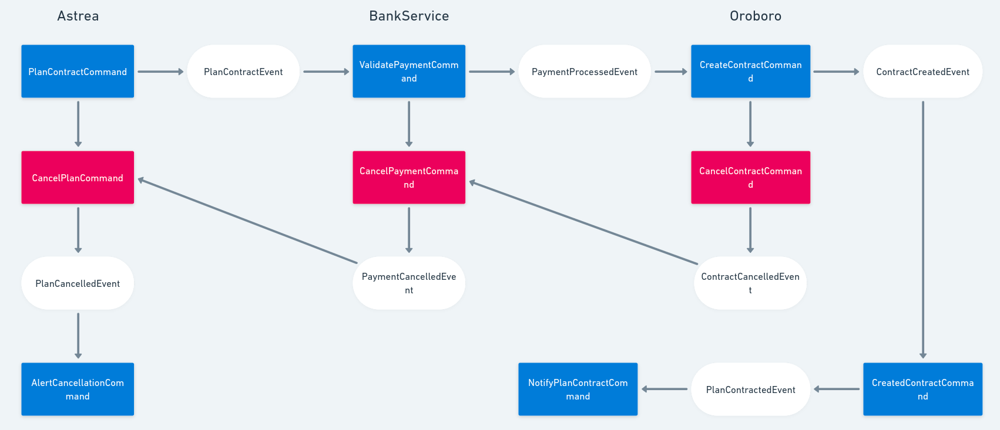

# Simple Saga Implementation

* astrea it's responsible for Orchestration Saga
* bank-service it's responsible for process payments
* oroboro-service it's responsible for apply Contract
* user-service it's responsible for execute queries
* common-service contains common events and commands

## flow diagram

